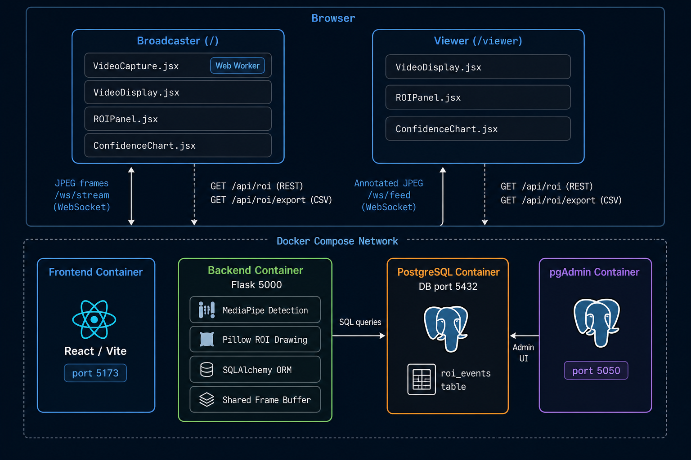

# 🎥 FaceStream — Real-Time Face Detection Video Streaming System

[](https://github.com/Riddhi-chavan/face-stream)



A fully containerised, full-stack application that captures webcam video in the browser, streams frames to a Flask backend over WebSockets, detects faces using **MediaPipe**, draws bounding boxes with **Pillow**, stores ROI data in **PostgreSQL**, and streams the annotated video back to a **React** frontend — all orchestrated with **Docker Compose**.

---

## 📋 Prerequisites

- [Docker](https://docs.docker.com/get-docker/) (v20+)
- [Docker Compose](https://docs.docker.com/compose/install/) (v2+)

That's it. No Python, Node, or PostgreSQL installation needed on your host machine.

---

## 🚀 Quick Start

```bash
# 1. Clone the repository
git clone <repo-url>
cd <project-root>

# 2. Create environment file
cp .env.example .env

# 3. Build and start all services
docker compose up --build
```

Once running:
- **Frontend**: [http://localhost:5173](http://localhost:5173)
- **Backend API**: [http://localhost:5000](http://localhost:5000)
- **pgAdmin**: [http://localhost:5050](http://localhost:5050)

### Usage
1. Open the frontend at `localhost:5173`
2. Click **"Connect Stream"** in the header to establish the WebSocket connection
3. Click **"Start Camera"** to activate your webcam
4. Watch the annotated output appear with real-time face bounding boxes
5. The ROI Events panel (right side) shows detection history from the database

---

## 📡 Endpoints

| Method | Path | Description |
|--------|------|-------------|
| `WS` | `/ws/stream` | Bidirectional WebSocket — send JPEG frames, receive annotated JPEG frames |
| `WS` | `/ws/feed` | Read-only WebSocket — broadcasts latest annotated frame |
| `GET` | `/api/roi` | REST — paginated ROI event data (`?limit=50&offset=0`) |
| `GET` | `/health` | Health check — returns `{"status": "ok"}` |

### `/api/roi` Response Format
```json
{
  "total": 312,
  "limit": 50,
  "offset": 0,
  "results": [
    {
      "id": 1,
      "frame_id": "uuid-...",
      "timestamp": "2025-01-01T12:00:00+00:00",
      "x": 120, "y": 80, "width": 200, "height": 210,
      "confidence": 0.97,
      "face_detected": true
    }
  ]
}
```

---

## 🏗️ How It Works

The browser captures webcam frames at configurable framerates (30/60/120fps) using a `<canvas>` element, encodes them as JPEG, and sends the raw bytes over a WebSocket to the Flask backend. The backend decodes each frame with Pillow, passes the RGB numpy array to MediaPipe's FaceDetection model, draws a red bounding box on detected faces using Pillow's `ImageDraw`, saves the ROI coordinates and confidence score to PostgreSQL via SQLAlchemy, and sends the annotated JPEG bytes back over the same WebSocket. The React frontend renders these annotated frames in real-time while a separate panel polls the REST API for recent detection events.

---

## 🧪 Running Tests

```bash
# Run all smoke tests
docker compose exec backend pytest tests/ -v

# Run specific test files
docker compose exec backend pytest tests/test_health.py -v
docker compose exec backend pytest tests/test_detection.py -v
docker compose exec backend pytest tests/test_roi_api.py -v
```

---

## 📂 Project Structure

```
project-root/
├── docker-compose.yml          # 4 services: db, backend, frontend, pgadmin
├── .env.example                # Environment variable template
├── architecture.png            # Architecture diagram
├── README.md
│
├── backend/
│   ├── Dockerfile
│   ├── entrypoint.sh           # Waits for DB, runs migrations, starts Flask
│   ├── requirements.txt
│   ├── app/
│   │   ├── __init__.py         # Flask app factory
│   │   ├── config.py           # Environment-based configuration
│   │   ├── extensions.py       # SQLAlchemy + Migrate instances
│   │   ├── models/
│   │   │   └── roi.py          # ROIEvent SQLAlchemy model
│   │   ├── routes/
│   │   │   ├── stream.py       # WS /ws/stream — bidirectional frame processing
│   │   │   ├── feed.py         # WS /ws/feed — annotated frame broadcast
│   │   │   └── roi.py          # REST /api/roi — paginated ROI data
│   │   ├── services/
│   │   │   ├── detection.py    # MediaPipe face detection
│   │   │   ├── drawing.py      # Pillow bounding box drawing
│   │   │   └── storage.py      # PostgreSQL ROI persistence
│   │   └── migrations/         # Alembic migrations
│   └── tests/
│       ├── conftest.py         # Pytest fixtures
│       ├── test_health.py      # Server + route smoke tests
│       ├── test_detection.py   # MediaPipe detection smoke tests
│       └── test_roi_api.py     # REST API smoke tests
│
└── frontend/
    ├── Dockerfile
    ├── package.json
    ├── vite.config.js          # Vite config with backend proxy
    ├── tailwind.config.js
    ├── index.html
    └── src/
        ├── main.jsx
        ├── App.jsx             # Main layout + WebSocket controls
        ├── index.css           # Global styles + Tailwind
        ├── components/
        │   ├── VideoCapture.jsx  # Webcam capture + frame sending
        │   ├── VideoDisplay.jsx  # Annotated frame rendering
        │   └── ROIPanel.jsx      # ROI event data table
        └── hooks/
            └── useWebSocket.js   # Reusable WebSocket lifecycle hook
```

---

## 🔒 Security

- All secrets loaded from environment variables (never hardcoded)
- `.env` excluded from version control via `.gitignore`
- CORS restricted to `http://localhost:5173` only
- WebSocket frame size limit: 1 MB (frames > 1 MB are rejected)
- PostgreSQL only accessible within the Docker network (not exposed to host)
- `/api/roi` query param `limit` capped at 100

---

## 🛠️ Tech Stack

| Layer | Technology |
|-------|------------|
| Frontend | React 18 + Vite 6 + Tailwind CSS 3 |
| Backend | Flask 3 + Flask-Sock (WebSockets) |
| Face Detection | MediaPipe (`mediapipe` Python package) |
| Bounding Box | Pillow (`PIL.ImageDraw`) |
| Database | PostgreSQL 15 + SQLAlchemy 2 + Flask-Migrate (Alembic) |
| Containerisation | Docker + Docker Compose |
| Testing | pytest + pytest-flask |

---

## 🤖 AI Usage Disclosure

This project was scaffolded with the assistance of **Antigravity**. Specifically, AI was used for:
- Generating the initial project structure and boilerplate code
- Writing the Flask app factory, route handlers, and service modules
- Creating the React components and WebSocket hook
- Writing Docker Compose configuration and Dockerfiles
- Generating the architecture diagram
- Writing this README

All generated code was reviewed and is provided as-is for the purposes of this project.

---

## 📄 License

MIT
